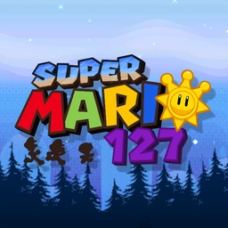

<div align="center">



# sm127_nx

**Super Mario 127 on Nintendo Switch**

An unofficial Nintendo Switch wrapper for the Android version of
**Super Mario 127**.

[](#)
[](#)
[](#)

</div>

---

## About

`sm127_nx` is a native wrapper that runs the ARM64 Android build of
**Super Mario 127** on Nintendo Switch. It loads the game's own Godot 3.6
engine library and recreates the Android, JNI, audio, input, networking and
graphics services it expects under Horizon OS.

This release targets **Super Mario 127 v0.9.1** for Android, ARM64, built with
Godot 3.6 from the
[Super Mario 127 source](https://github.com/Level-Share-Square/SuperMario127).
An engine older than Godot 3.6 is refused with a message on screen rather than
failing later.

Each release includes the Android APK, built from the public Super Mario 127
source.

---

## Controls

The port uses the game's own controller scheme. Every action can be remapped
in **Options > Controls**.

| Input | Action |
| --- | --- |
| **Left Stick / D-Pad** | Move |
| **A** | Jump, confirm |
| **B** | Switch FLUDD nozzle, back |
| **X / Y** | Spin |
| **ZL** | FLUDD |
| **ZR** | Dive |
| **R / D-Pad Down** | Ground pound |
| **D-Pad Up** | Interact |
| **-** | Switch FLUDD nozzle |
| **+** | Pause |
| **L3** | Toggle the UI and photo mode |
| **R3** | Reload the level |
| **Touchscreen** | Menus and the level editor in handheld mode |

Level Share Square uses the game's on-screen cursor. Move it with the stick or
D-Pad, press A to click, and hold it at the top or bottom edge to scroll. Text
fields open the system keyboard.

To use the level editor with a controller, set `cursor 1` in `config.txt`. R
then toggles a pointer: the left stick moves it, A or ZL clicks, Y or ZR
right-clicks and L recentres it.

---

## Build

### Requirements

* devkitPro
* devkitA64 and libnx
* Switch Mesa and libdrm_nouveau
* Switch libpng and zlib
* GNU Make

Install the required devkitPro packages:

```bash
pacman -S switch-dev switch-mesa switch-libdrm_nouveau switch-libpng switch-zlib
```

Compile the wrapper:

```bash
cd sm127_nx
make -j
```

For a clean rebuild:

```bash
make clean
make -j
```

The in-game helper scripts in `port/` are built into the NRO's RomFS.

`scripts/extract_apk.sh` unpacks an APK on a computer and fails if the wrapper
cannot bind any of the engine's native imports. It needs Python 3 and unzip:

```bash
scripts/extract_apk.sh /path/to/SuperMario127-0.9.1-android-arm64.apk
```

---

## Running

Download `sm127_nx.nro` and the Android APK from the releases page.

Create this folder on the SD card and put both files in it:

```text
sd:/switch/sm127/
├── sm127_nx.nro
└── SuperMario127-0.9.1-android-arm64.apk
```

The file name does not matter as long as it ends in `.apk`.

The first launch unpacks the engine libraries, packs the game data into one
file, checks every file against the checksum the archive recorded for it, and
then deletes the APK. It shows its progress on screen. To keep the APK, create
`config.txt` in the same folder with the line `keep_apk 1` before the first
launch.

Afterwards the folder looks like this:

```text
sd:/switch/sm127/
├── sm127_nx.nro
├── config.txt
├── libgodot_android.so
├── libc++_shared.so
├── assets/
│   ├── sm127.pck
│   ├── override.cfg
│   └── installed_from.txt
├── save/
├── boot_stats.txt
└── sm127_debug.log
```

The folder can have any name under `/switch/`. Settings, saves and downloaded
levels live in `save/`.

Launch the NRO through title override for full application memory: hold **R**
while opening an installed game, then start **Super Mario 127** from the
Homebrew Menu. Starting the Homebrew Menu from the Album gives the game far
less memory.

To update, replace `sm127_nx.nro`. The installed game stays as it is. Put a new
APK in the folder to reinstall it.

Settings live in `config.txt`, which is written on the first launch and
explains each option in place.

---

## Status

Gameplay, audio, controller and touchscreen input, and Level Share Square are
working, including browsing, searching, signing in, and downloading and
playing levels.

The level editor has had less testing than the rest of the game. Discord links
are not opened, since Discord cannot be used in the Switch browser.

The wrapper is built for **Super Mario 127 v0.9.1** for Android. Other releases
have not been tested.

---

## Credits

**Super Mario 127 Nintendo Switch port**: aks796

**Super Mario 127**: Solarshine Studios,
[github.com/Level-Share-Square/SuperMario127](https://github.com/Level-Share-Square/SuperMario127)

Online levels are hosted by [Level Share Square](https://levelsharesquare.com).

The game runs on the [Godot Engine](https://godotengine.org), which is
MIT-licensed.

The loader and compatibility layer derive from the open-source Switch `.so`
loader work by Andy Nguyen (TheOfficialFloW), fgsfds, NaGaa95 and elliencode,
and were forked from `sm63_nx`. The inherited wrapper code is MIT-licensed. See
`LICENSE`.

Built with devkitPro, libnx and Switch Mesa.

---

## Contributing

Bug reports and tested improvements are welcome. Include the version, steps to
reproduce, and `sm127_debug.log` and `boot_stats.txt` from the app folder when
reporting an issue. If the game closed by itself, include `sm127_fatal.txt` as
well.

---

## Disclaimer

This is an unofficial fan project and is not affiliated with, sponsored by or
endorsed by Nintendo. Super Mario 127 is a fan game by Solarshine Studios.
Mario and all related characters and trademarks belong to Nintendo.

Releases include an Android build of Super Mario 127 made from the game's
public source code, which its developers have made free to use.
